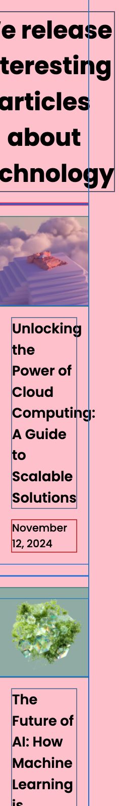
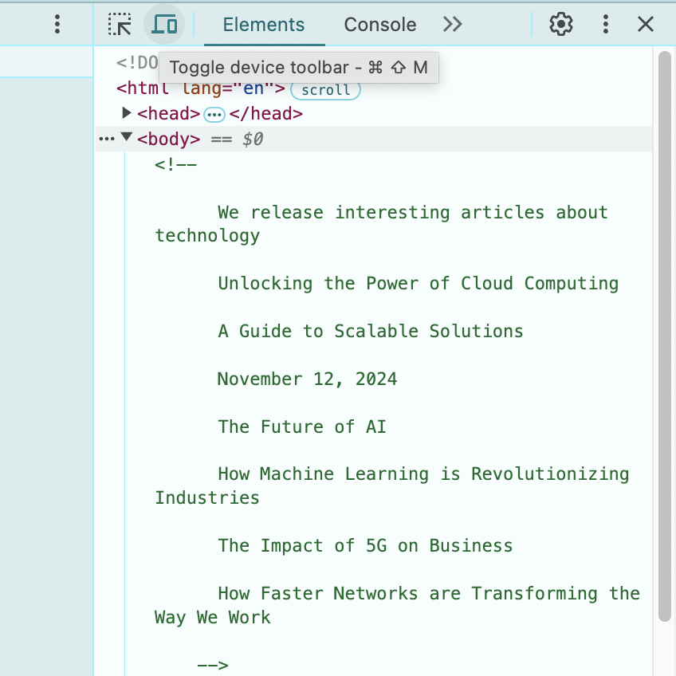
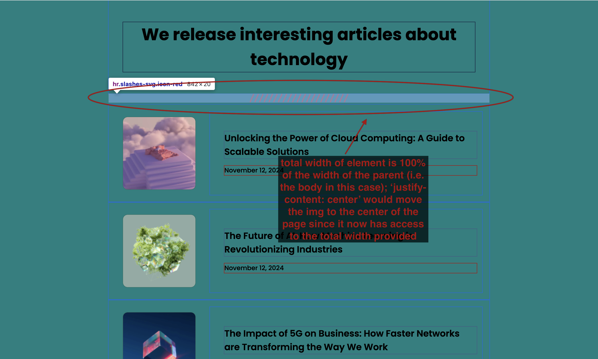

<!-- Please update value in the {}  -->

<h1 align="center">Simple Article | devChallenges</h1>

<div align="center">
   Solution for a challenge <a href="https://devchallenges.io/challenge/simple-article-listing" target="_blank">Simple Article Listing</a> from <a href="http://devchallenges.io" target="_blank">devChallenges.io</a>.
</div>

<div align="center">
  <h3>
    <a href="https://simple-article-listing-two.vercel.app/}">
      Demo
    </a>
    <span> | </span>
    <a href="https://github.com/dc-code-creations/simple-article-listing/tree/main">
      Solution
    </a>
    <span> | </span>
    <a href="https://devchallenges.io/challenge/simple-article-listing">
      Challenge
    </a>
  </h3>
</div>

<!-- TABLE OF CONTENTS -->

## Table of Contents

- [Overview](#overview)
  - [What I learned](#what-i-learned)
  - [Useful resources](#useful-resources)
- [Built with](#built-with)
- [Features](#features)
- [Contact](#contact)
- [Acknowledgements](#acknowledgements)

<!-- OVERVIEW -->

## Overview


<!-- 
Introduce your projects by taking a screenshot or a gif. Try to tell visitors a story about your project by answering:

- What have you learned/improved?
- Your wisdom? :)

-->

The overall visual aspect of this page was relatively easy, so I decided to focus on the accessibility size of things. I focused most of this attention on the ```<hr>``` element since the mock up wanted us to display it as a set of slashes versus your typical horizontal rule. It took some digging to figure out which way worked the best practically and well as for accessibility, but I ended up going with a mask due to its ability to have its color changed dynamically via css classes. I also learned a little bit more about the ```width``` property works in relation to its parent element. I also decided to start by creating the mobile version first and work my way up the screen sizes which is the opposite of what I usually do. I did feel a little different, but not bad, and ultmately makes more sense due to how many people access websites solely from their phones these days, so I will do my best to keep the habit. I took the time to do some simple performance testing was well to make sure my website wasn't running expectionally slow. I did end up adding a hover animation for the article cards just to make it a little nicer. So, for the majority of this project, I was researching how to go about doing these things properly since I have never really done them before as part of my regular routine. I hope to be able to keep up all of these habits in my future projects to ensure our visitors have the best user experience.

### What I learned

<!-- Use this section to recap over some of your major learnings while working through this project. Writing these out and providing code samples of areas you want to highlight is a great way to reinforce your own knowledge. -->

What I did:
- started by creating mobile version first, then worked my 
  way up to larger sizes; found color coding the screen size using a background color while I'm working with helps me keep track of which size I'm affecting
- decided it's best to use bootstrap breakpoints for screen sizes as a starting point since my natural breakpoints ended up being pretty close to those breakpoints anyway
- reminder: font sizes are affected by the element's base font size when using rem, so the assigned font size for an ```<h1>``` might be the same as the one for an ```<h3>```, but their physical sizes will be different
- I need more practice with media queries to make them more second nature just so I don't have to go an remind myself how they work everytime
- set a min-width on the body at the point where the elements start trying to push past the widest element on the page (using a css debugger extensions helps with this; just click the toggle device toolbar button the in inspector to reset the page once you've added the min-width to the body)

Element Misalignment w/ No Min-Width Defined




Element Alignment Correction Via Min-Width Definition


Toggle Device Toolbar Button in Inspector




- figure out how to use an svg as a ```<hr>```; these articles seem to be the most recent and therefore up-to-date:
    - https://forum.bootstrapstudio.io/t/create-a-hr-with-an-icon-inside/11669 (works but had to remove the 'width: 30px' in the ::after psuedoclass... and make sure I was pointing to the correct file location; can either choose to apply it to ::before and translate backwards or apply it to ::after and translate forwards)
        - https://www.geeksforgeeks.org/how-to-use-svg-with-before-or-after-pseudo-element/ (this article shows what is physically a happening for each psuedoclass a bit better, so it was easier to visualize this way, but it uses the background image property, which I don't think works unless there is an actual element in the content field, so may work if you add spaces)
    - https://www.sarasoueidan.com/blog/horizontal-rules/#:~:text=The%20best%20way%20to%20get%20the%20full%20flexibility%20of%20an%20SVG%20is%20by%20inlining%20it (this article talks about using an svg as a ```<hr>``` and keeping it accessible using ARIA (Accessibility Rich Internet Applications), but I have not gotten this to work for me yet)
    - https://www.shecodes.io/athena/57595-how-to-change-svg-color-with-css#:~:text=How%20to%20change%20svg%20color%3F (can set the color of an svg via the fill property in the rect element of an svg file image or by using the 'rect' selector and modifying the 'fill' property (seems to only work on svgs defined in the html file itself))
        - https://www.reddit.com/r/css/comments/1chvdbg/how_to_colorstyle_a_background_svg/ (using the svg as a background image makes it a static image when in the browser, so there's no way to style it via it's properties)
        - https://codepen.io/sosuke/pen/Pjoqqp (this seems to be a workaround for the background image color issue (likely is necessary when importing the image via content property, as well), but is more effort than it is worth; if you need to change the color of the svg dynamically, seems best to just make it a physical element in the html file if possible)
        - https://stackoverflow.com/questions/73195948/change-color-fill-of-a-svg-path-when-used-in-the-content-of-a-before-pseudo-el (can literally copy the code from the svg into the -webkit-mask property, give the background property a var() to work with, and then on the element you want to effect, set the variable to the color you want it to be via the style attribute; just make sure to change all the '#' in your color definitions (ex: #D9D9D9) to '%23' (ex: %23D9D9D9) or it won't show up; 
        
        ex:
          ```css    
            /* CCS File */
              div::before {
                display: inline-block;
                width: 18px;
                height: 18px;
                content: '';
                background: var(--c);
                -webkit-mask: url("data:image/svg+xml;utf8,<svg  xmlns='http://www.w3.org/2000/svg' viewBox='0 0 448 512'><path  d='M350.85 129c25.97 4.67 47.27 18.67 63.92 42 14.65 20.67 24.64 46.67 29.96 78 4.67 28.67 4.32 57.33-1 86-7.99 47.33-23.97 87-47.94 119-28.64 38.67-64.59 58-107.87 58-10.66 0-22.3-3.33-34.96-10-8.66-5.33-18.31-8-28.97-8s-20.3 2.67-28.97 8c-12.66 6.67-24.3 10-34.96 10-43.28 0-79.23-19.33-107.87-58-23.97-32-39.95-71.67-47.94-119-5.32-28.67-5.67-57.33-1-86 5.32-31.33 15.31-57.33 29.96-78 16.65-23.33 37.95-37.33 63.92-42 15.98-2.67 37.95-.33 65.92 7 23.97 6.67 44.28 14.67 60.93 24 16.65-9.33 36.96-17.33 60.93-24 27.98-7.33 49.96-9.67 65.94-7zm-54.94-41c-9.32 8.67-21.65 15-36.96 19-10.66 3.33-22.3 5-34.96 5l-14.98-1c-1.33-9.33-1.33-20 0-32 2.67-24 10.32-42.33 22.97-55 9.32-8.67 21.65-15 36.96-19 10.66-3.33 22.3-5 34.96-5l14.98 1 1 15c0 12.67-1.67 24.33-4.99 35-3.99 15.33-10.31 27.67-18.98 37z'/></svg>") center no-repeat;
              }

            /* HTML File */
              <div style="--c:red;"></div>
              <div style="--c:orange;"></div>
              <div style="--c:yellow;"></div>
              <div style="--c:green;"></div>
              <div style="--c:blue;"></div>
              <div style="--c:indigo;"></div>
              <div style="--c:violet;"></div>
          ```
        this seems to allow you to change the color dynamically since it can now be altered directly via the element)
        - https://codepen.io/noahblon/post/coloring-svgs-in-css-background-images (this article says that there are performance benefits to using SVGs as background images or sprites rather than as inline SVGs while also explaining how to alter the color when used as a background image or a sprite)
        - https://codepen.io/noahblon/pen/PovZva (examples of svg masks being used to better understand what's going on)
    - https://www.smashingmagazine.com/2021/05/accessible-svg-patterns-comparison/ (if you want to enter an svg directly into your html, here are some ways to make it accessible)
    - https://stackoverflow.com/questions/10403138/what-is-the-purpose-of-the-role-attribute-in-html (this article supports the idea of trying to use a regular ```<hr>``` with the svg as the background image due to the sematics and behavior already associated with the ```<hr>```; this element is already semantically appropriate, so we should go ahead and try to use it instead of overriding the behavior of another element)
    - 4 options I found that seem to work
        - for all options, define a class that you will put on the ```<hr>``` that sets the following properties:
            ```css
                position: relative;
                border-top: 0;
                border: 0;
                height: 20px;
                opacity: 1;
            ```
            - all 4 options use these properties
        - option 1: in either ```::before``` or ```::after``` psuedoclass, set the 'content' property to the svg you want to use (will not be able to change color with out a mask in this case), set ```position``` to absolute, set 'left' to 50%, and translate it 50% back to the left

        https://codepen.io/dc-code-creations/pen/EaYGexW

        - option 2: in either ```::before``` or ```::after``` psuedoclass, set the ```display``` to inline-flex or inline-block (doesn't seem to matter which one), ```content``` to an empty string, ```background-image``` to the svg (will not be able to change color with out a mask in this case) with no-repeat and center, ```background-size``` to contain, and both the ```width``` and ```height``` to 100%

        https://codepen.io/dc-code-creations/pen/ogvmVaY

        - option 3: very similar to option 2; in either ```::before``` or ```::after``` psuedoclass, set the ```display``` to inline-flex or inline-block (doesn't seem to matter which one), ```content``` to an empty string, and both the ```width``` and ```height``` to 100%; for ```background```, set it to ```var(--c)``` (this is a function used to insert value of a custom property from elsewhere, whether it is the html or js) and ```-webkit-mask``` to the code for the svg itself; in the html, set the ```style``` attribute on the ```<hr>``` to ```style="--c:#D9D9D9"```

        https://codepen.io/dc-code-creations/pen/XJrOGyJ

        - option 4: in the initially defined class from above (so no psuedo classes necessary), set the ```display``` to inline-flex or inline-block (doesn't seem to matter which one), ```content``` to an empty string, and ```width``` to 100%; set both ```mask``` and ```-webkit-mask``` to import the svg (image is fine) with it set to 'no-repeat' and the ```position``` set to '50% 50%'; set both the ```mask-size``` and the ```-webkit-mask-size``` to 'contain' (make the image stretch to fill the space without warping the image); then create another class to define the color you want the icon to be (color appears as a result of the mask) and add that class to the ```<hr>```

        https://codepen.io/dc-code-creations/pen/ByBMbGV

    - can't really adjust the color for the first 2 options dynamically, so color of the icon will need to be written into the SVG image itself; 3rd option works and is dynamic, but hard to adjust if you have multiple ```<hr>``` elements whose colors all need to be changed at the same time
    - I like the 4th option best due to the ability to be able to change the color of multiple ```<hr>``` (that are the same color) by changing the color in the css vs on every individual element; even for ```<hr>``` that needs to be a different color, there will still be one place to adjust the color itself as long as it has the correct color class added to its class attribute
        - tested the functionality of this option on an iPad (both 10th gen and M-chip), MacOS, and an android phone; all of them worked fine with the exception on the 10th gen iPad (on both Chrome and Safari); not sure exactly why that is the case; all I could gather from some googling was that there might be a setting or property that is turned off on iOS that might keep it from running, but no one had quite the same issue I was having; I did manage to run a 10th gen simulator on my MacOS using XCode, and it worked fine on there, so I guessing it was either a fluke or that the browsers needed to be updated
        - source for getting the simulator to work: https://www.youtube.com/watch?v=5DbMomHr5ys&ab_channel=TECHMART
        - can't use isolated padding properties (i.e. things like ```padding-top``` or ```padding-bottom```) with this very as easily since the mask always reposition to be in the center of the container (i.e. the 50% 50% given for the mask position), so it is best to use margins if you want to add space to only one side of the ```<hr>```
- ```width```: sets the size of the element container relative to the size of the parent conatiner, and any adjustments you try to make relative to the container size will be relative to the ELEMENT's container size, not the parent's; translations will be needed for anything
    - ex: setting element ```width: 100%``` makes the element container's width 100% of the PARENT's width, but the container still starts at 0px from the left of the PARENT's left edge; still have to translate the whole element container to get it to be in the center
        - so any justifying content or aligning items sets the elements relative to the size of the ELEMENT's container, not the parent's 
    - I was thinking the element's container always kept track of what 100% was, so even if you made the width of the element container smaller than the parent, you would still be able to reposition the element itself with something like ```justify-content```, but that is not the case

    - Here is when the element width is set to 50%

        

    - Here is when the element width is set to 100%

        

- testing for performance
    - https://www.youtube.com/watch?v=eDUMeQX-Mvo&ab_channel=MakeMoneyAnthony (gave me some recommendations on sites to use for testing performance)
        - https://tools.pingdom.com/
        - https://pagespeed.web.dev/
        - https://gtmetrix.com/
    - found that an element was shifting on my page causing my CLS (Cummulative Layout Shift) score to be a bit too high
        - The most common causes of a poor CLS are:
            - Images without dimensions.
            - Ads, embeds, and iframes without dimensions.
            - Dynamically injected content such as ads, embeds, and iframes without dimensions.
            - Web fonts.
            - source: https://web.dev/articles/optimize-cls#:~:text=The%20most%20common%20causes%20of%20a%20poor%20CLS%20are
        - could be due to the ```<hr>``` element that I am pushing an SVG into (https://www.reddit.com/r/webdev/comments/vdhmuw/comment/ickaoaz/?utm_source=share&utm_medium=web3x&utm_name=web3xcss&utm_term=1&utm_content=share_button)
        - may be due to the image sizes not being specified on the page (https://stackoverflow.com/questions/63372837/why-is-an-embedded-svg-causing-cls-cumulative-layout-shift-on-desktop-but-not)
        - might just be due to the fonts themselves
        - looks like it was the image sizes not being specified on the page
            - CLS went from ~0.8 to ~0 on both mobile and desktop after fixing this (https://pagespeed.web.dev/analysis/https-simple-article-listing-two-vercel-app/6twj2czff9?form_factor=desktop)
- testing for accessibility
    - https://www.reddit.com/r/webdev/comments/1blhwjk/how_do_you_test_your_website_for_accessibility/ (goes over why you shouldn't just use tools like Wave)
    - https://dequeuniversity.com/screenreaders/ (learn to use screen readers)
    - https://www.youtube.com/watch?v=cOmehxAU_4s&ab_channel=ChromeforDevelopers (goes through proper ways to test your site for accessibility)
        - using VoiceOver on Mac as my screenreader of choice
    - https://www.youtube.com/watch?v=iIoHdxmC8eM&ab_channel=WordPressAccessibilityDay (making my cards accessible)
        - updated articles list to include ```<ul>```, ```<li>```, and ```<a>``` elements to make page more accessible
- article card widths were not uniform at large tablet screensize; to fill out the remaining spacing of a container when using flex, I added padding to the right side of the element to fill it out; this was the only screensize that still had this problem for some reason

### Useful resources

<!--
- [Example resource 1](https://www.example.com) - This helped me for XYZ reason. I really liked this pattern and will use it going forward.
- [Example resource 2](https://www.example.com) - This is an amazing article which helped me finally understand XYZ. I'd recommend it to anyone still learning this concept.
-->

### Built with

<!-- This section should list any major frameworks that you built your project using. Here are a few examples.-->

- Semantic HTML5 markup
- CSS custom properties
- Flexbox
- CSS Grid

## Features

<!-- List the features of your application or follow the template. Don't share the figma file here :) -->

- a list of articles that can be clicked (however, they do not redirect to a new page)
- article cards get slightly larger when hovered over

This application/site was created as a submission to a [DevChallenges](https://devchallenges.io/challenges-dashboard) challenge.

## Acknowledgements

<!-- This section should list any articles or add-ons/plugins that helps you to complete the project. This is optional but it will help you in the future. For exmpale -->

## Author

- Website [https://daracline.gitlab.io/](https://daracline.gitlab.io/)
- GitHub [@dc-code-creations](https://github.com/dc-code-creations)
